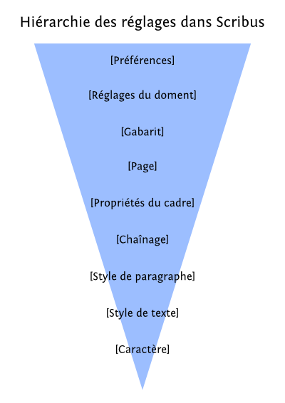
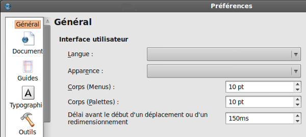

Problemi ricorrenti
===================

"Non funziona!" è il grido del cuore che viene a volte in piena
impaginazione, perché qualcosa non risponde alle nostre aspettative, o
addirittura contraddice ciò che si vuole ottenere!

 La prima cosa da fare è di rileggere la sezione di questo manuale
corrispondente a quello che state facendo, per capire tutti gli aspetti
e i dettagli della vostra azione.

Quindi, riflettete sul vostro problema, e verificate se non siano state
impostate in diverse aree del layout di pagina regole che sono in
conflitto, contrariamente a quanto si sta cercando di fare, come per
esempio, tentare di spostare una immagine che avete precedentemente
bloccato.

Qual è il metodo per orientarsi?
--------------------------------

Alcuni dettagli possono diventare realmente bloccanti quando non si
riesce ad individuare l'origine del problema. In questi casi, è bene
avere in mente la gerarchia delle regole per l'applicazione in Scribus:
In effetti, il risultato che si vede sullo schermo è condizionato dalla
somma delle impostazioni che sono state definite al fine e su misura del
nostro lavoro.

Più l'impostazione è ad un livello elevato (ad esempio in [Impostazioni
documento] ), più sarà applicato globalmente, più va in contraddizione
con le impostazioni dei livelli inferiori (ad esempio quelle di
[Proprietà della pagina]) che introducono delle eccezioni. Questo
sistema ci consente di avere una pagina più grande e ripiegata in un
libro, per includere ad esempio una mappa.

Conoscere questo meccanismo, di fatto ci permette di risolvere molti
problemi, perché la maggior parte degli errori sono legati ad una errata
interpretazione di questa gerarchia di impostazioni: posizionarsi in
questa gerarchia permette di localizzare il nostro problema, e quindi
risolverlo!

Ecco un semplice schema teorico della gerarchia delle impostazioni, dal
livello più alto al più basso:

Quindi si tratta semplicemente di agire al livello giusto per risolvere
immediatamente il problema.

Sono bloccato con uno strumento!
--------------------------------

Dopo aver disegnato ad esempio una cornice, Scribus ritorna
automaticamente allo strumento di selezione elemento (freccia bianca),
che consente di spostare e di selezionare.  Se avete l'impressione di
essere bloccati con uno strumento, potete sempre tornare alla freccia
bianca, selezionandola nella barra degli strumenti, o premendo [esc].

Le mie cornici di testi saltano e si spostano
---------------------------------------------

Per il mouse o lo stilo per i proprietari di tavolette grafiche, può
essere che la selezione delle cornici di testo (un clic) possa spostarla
di pochi pixel. Un'impostazione nelle preferenze del software attenua
notevolmente questo comportamento. Lanciare [File \> Preferenze...] ed
esaminare le impostazioni visualizzate nella scheda Generale. Per
impostazione predefinita, il tempo di ritardo prima dell'inizio dello
spostamento o di un ridimensionamento è impostato su 150 ms. Aumentare a
300 se ne ravvisate la necessità.

