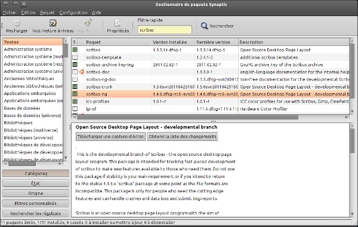
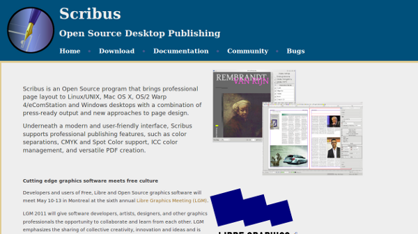

Installazione
=============

Perché trattare dell'installazione alla fine del libro? L'installazione
è certamente il passo indispensabile per l'inizio e l'uso del software,
ma non è parte integrante del funzionamento del software stesso. Questo
libro si è concentrato sin dall'inizio sulle buone pratiche di
progettazione grafica associate alle funzioni di Scribus, e infatti gli
autori hanno scelto di inserire le procedure di installazione a margine
dell'utilizzo effettivo del software. Il sito [scribus.net](scribus.net)
elenca tutti i pacchetti e qualche procedura di installazione.

Le versioni
-----------

Prima di installare Scribus, è conveniente capire il principio delle
versioni di Scribus. In effetti, il software libero spesso ha una
procedura per la numerazione speciale, adattata al ritmo del suo
sviluppo.

Nel caso di Scribus e al momento della stesura di questo libro, la
versione stabile ufficiale è la versione 1.4 .1 (al 2012-10-21). E'
superata da una versione di sviluppo, la versione 1.5 (Trunk), non
raccomandata nell'ambito di un uso professionale, ma nonostante ciò è
accessibile, e può coesistere con una versione stabile. Il ciclo di
sviluppo, quando la versione 1.5 sarà stabile, prenderà il numero 1.6.

Quindi per il momento  utilizzare la versione 1.4, che è stabile per
essere scaricata, installata e gestita indipendentemente dal sistema
operativo.

Per Linux
---------

In ragione del suo status di software libero, Scribus è disponibile su
tutte le distribuzioni Linux. Alcune dispongono di un pacchetto di
installazione, altri fanno appello direttamente ai sorgenti del
software.

### I pacchetti

Scribus è disponibile nel pacchetto RPM per le distribuzioni derivate da
Red Hat, comprendente quest'ultima, ma anche Suse o Mandriva.  Accadrà
spesso che il pacchetto di software sarà installato con la
distribuzione. Questo è il caso di Mandriva, in cui è accessibile
tramite il menu Applicazioni.

### Gestione dell'installazione

Linux gode di una procedura per l'installazione automatica e adattata
all'architettura del sistema, con cui aiutarsi. La maggior parte delle
distribuzioni Linux hanno un'interfaccia grafica, che evita all'utente
di inserire comandi per l'installazione: drakrpm per Mandriva, YaST per
Suse, Synaptic per Ubuntu, ecc.

Sarà a volte necessario impostare chi è in grado di installare i
pacchetti da una sorgente esterna, come testimonia la procedura di
installazione per i pacchetti per Debian e Ubuntu proposti sul sito
scribus.net:
[http://wiki.scribus.net/canvas/Debian](http://wiki.scribus.net/canvas/Debian).

### I sorgenti

Come qualsiasi software libero, Scribus rende disponibili i sorgenti.
Compilare i sorgenti di un software non è raccomandato per gli utenti
più inesperti (o che non amano l'avventura) e gli autori di questo libro
vi rimandano quindi alla documentazione ufficiale della vostra
distribuzione.

L'interesse di un'installazione da sorgenti è che, in generale, voi
possedete la versione più recente del software, e che disponete dei più
recenti miglioramenti.

Per windows
-----------

Qui l'installazione è più semplice poiché basta scaricare il programma
di installazione in forma di un eseguibile, direttamente nello spazio
Download di scribus.net.

*Il sito ufficiale di Scribus*

Mac OS X
--------

Come per Windows, Mac OS X dispone di un installatore. Il pacchetto DMG
si trova anche nello spazio di Download di scribus.net, ma è accessibile
solo per la versione 1.4 . La versione precedente 1.3, richiede
l'installazione di un server grafico X11, è del tutto privo di stabilità
e leggibilità; questa procedura non è raccomandata sul sito ufficiale né
dagli autori di questo libro.
