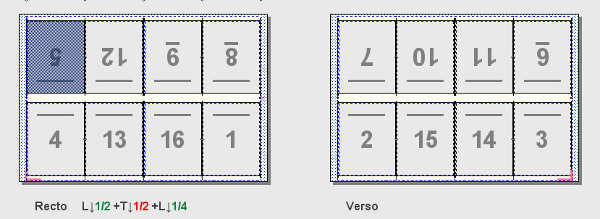
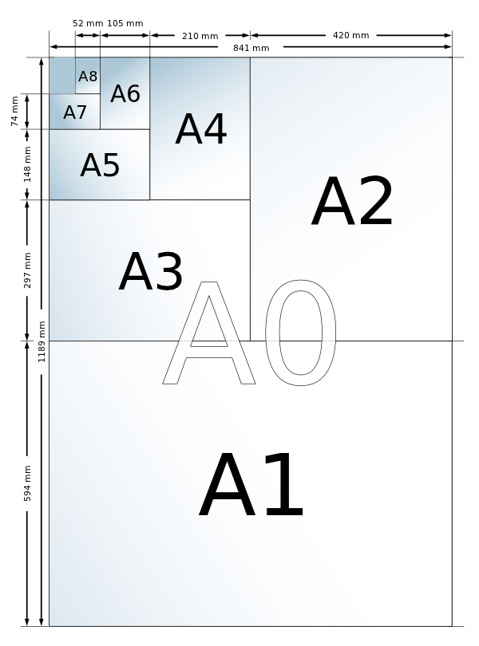
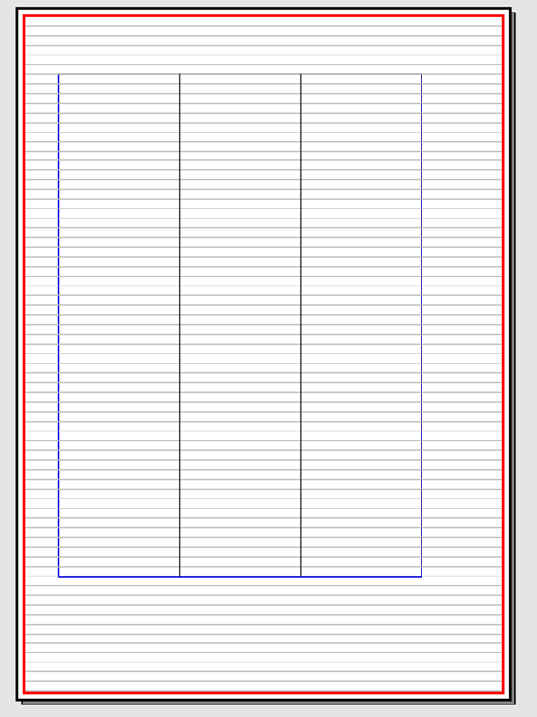
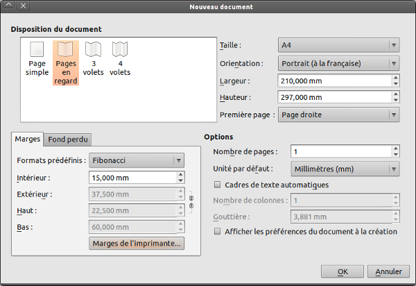
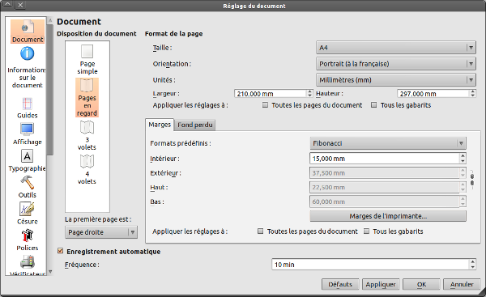

Formati
=======

Per la creazione di un documento, la questione del formato è
fondamentale.  Il formato è determinato dal contenuto: la sua densità,
ma anche il suo significato, la propria gerarchia, la sua segmentazione
ed il suo obiettivo. Il menu [File \> Nuovo o ctrl+N] richiama una
finestra piena di varie opzioni, a volte confondono il principiante, ma
sono indispensabili per la progettazione di qualsiasi documento. È
opportuno anticipare al meglio le esigenze del documento, non solo per
la sua realizzazione, la impaginazione, ma soprattutto in vista del
prodotto finale.

Dimensioni
----------

Per un documento destinato alla stampa, è comune rispettare le
dimensioni per soddisfare i flussi di lavoro ed è basato sulle norme
ISO. I più comuni standard è la famiglia dei formati A, tra cui il
comune formato A4, utilizzato in particolare per le stampanti desktop.

### Il principio dell'imposizione tipografica

A seconda della tecnologia di stampa, la stampante può effettuare una
imposizione, un assemblaggio e una disposizione delle pagine in un
formato di foglio molto più grande al fine di ottenere una segnatura
ottimizzata dopo la piegatura. Questo processo permette non solo
economie di disposizione e di manipolazione, ma anche per la stampa fino
ai bordi della pagina.

 \

### Rispettare le proporzioni

L'imposizione è possibile solo a partire dal momento in cui i diversi
formati di una famiglia sono proporzionati tra loro. Il rapporto tra i
lati di un foglio A, per esempio, è pari alla radice quadrata di due. In
questo rapporto, è possibile montare in una dimensione due fogli dal
formato direttamente inferiore, questo comportamento si riflette in
tutti i formati. In questo modo è possibile realizzare sezioni
ripiegate, e poi tagliate. L'imposizione più comune consiste di 16
pagine di formato A4 su un foglio di formato A0.

### Scegliere la giusta dimensione

Formati personalizzati sono consigliati solo nel caso di una richiesta
particolare o di una ricerca grafica. La maggior parte del tempo, è
meglio ridurre la vostra scelta ai formati più comuni, che sono stati
determinati anche sulla base delle vostre capacità.

La produzione di documenti stampati è quindi generalmente attorno al
formato A4, anche in caso di piegatura, come nel caso di un volantino a
tre ante. Nel caso di una richiesta specifica, conviene rivolgersi
piuttosto alla tipografia per la realizzazione di uno studio di
fattibilità e costi.

Nel menu a discesa [File \> Nuovo] nella finestra di creazione del
documento, Scribus offre [Dimensione:] un elenco esaustivo delle norme,
dall'A4 al formato Letter americano, e anche al Quarto, in grado di
soddisfare sia le esigenze dei più creativi che i vincoli legati alle
norme ed ai costi di stampa.

 \

Orientamento
------------

Distinguiamo due tipi di orientamento:

-   **Verticale**(Ritratto), è il più diffuso. Si tratta di un
    orientamento verticale, più maneggevole e più adatto alle capacità
    dell'occhio umano, che si stanca rapidamente in caso di linee troppo
    lunghe. Per questi motivi, ed a prescindere dalle dimensioni, è
    l'orientamento che è più comunemente utilizzato.
-   **Orizzontale** (Paesaggio), è meno diffuso in quanto rispetta di
    meno gli imperativi di leggibilità o maneggiabilità, ma può
    rispondere a dei criteri creativi o di contenuto, come un legame
    specifico.

Le misure
----------

Le unità di misura sono importanti perché verranno utilizzate in tutte
le dimensioni e coordinate: Layout, margini, dimensioni dei blocchi, il
corpo di caratteri, ecc.

Per impostazione predefinita, le misure sono espresse in punti, standard
di origine anglo-sassone per il corpo del carattere, che storicamente è
servito come base per molti rapporti proporzionali intorno al multiplo
di sei. Per esempio, una linea con altezza di dodici punti, significa un
sesto di pollice. Questo rapporto permette, ad esempio, di determinare
la parte di pagina da assegnare al blocco di testo per essere
proporzionale alla pagina.

Il sistema metrico internazionale rimane, tuttavia, lo standard di
rigore. In Scribus, la conversione tra i punti e i millimetri è
immediato ed automatico. Pertanto, in qualsiasi momento è possibile
utilizzare l'unità che riteniamo sia migliore. In generale, il corpo
sarà specificato in punti, ma potreste desiderare il testo di 1cm di
altezza senza conoscerne l'equivalente. In questo caso, vedete 1 cm nel
campo, e Scribus farà il calcolo per voi. Il comfort di lavoro da questo
punto di vista è il bene massimo.

La finestra di creazione di un documento di Scribus consente, in
[Preferenze], di definire una unità [default] che sarà applicata al
documento di lavoro. Se dimenticate di specificarlo, tale modifica può
essere fatta in qualsiasi momento in [File \> Impostazioni documento...
\> Documento]. Se si desidera utilizzarlo in tutti i documenti, si
consiglia di impostarlo nelle preferenze, [File \> Preferenze \>
Documento], che eviterà qualsiasi dimenticanza in seguito.

*In questo esempio, le righe di testo con 12 punti proposti dalla
griglia tipografica si adattano perfettamente ai margini del documento,
espresso in pollici, ed integrati in un layout di pagina proporzionale,
anche se in origine, le misure di un A4 sono espresse in millimetri*.

Layout del documento
--------------------

Le impostazioni per il layout del documento fanno riferimento ai
concetti di dimensione e di imposizione introdotti in precedenza. Questo
parametro definisce il modo in cui il documento deve essere piegato,
tranciato e quindi eventualmente rilegato.

-   [Pagina singola] è da considerarsi in caso di documenti in cui le
    pagine non sono destinate ad essere visualizzate a due, come poster,
    volantini, ecc., e altri casi speciali come i documenti destinati a
    una lettura a video.
-   [Doppia facciata] è il modo comune perché consente di gestire il
    fronte-retro, così come la piega centrale per le pagine speculari.
    Pertanto, è privilegiata per la grande maggioranza dei documenti
    stampati, dalla rivista all'opuscolo commerciale.
-   [Pieghevoli 3 falde] e [Pieghevoli 4 falde] facilitano la
    separazione di documenti in parti identiche. Ogni pagina creata
    rispetterà quindi una struttura a riquadri. È importante prevedere a
    monte il formato finale del documento perché ad ogni nuova sezione
    creata per completare il primo sarà assegnato il formato A4. Tali
    disposizioni sono generalmente abbandonate a favore di una pagina
    semplice e ben organizzata.

Le opzioni completano gli adeguamenti per la disposizione, come il
[numero di pagine], che è possibile individuare fin dall'inizio, ma che
possono essere modificate se necessario in qualsiasi momento della
disposizione. L'utente ha anche la possibilità di applicare cornici di
testo [Inserisci \> Inserisci cornice di testo] a ogni pagina. Questa
opzione può rivelarsi utile nel caso in cui il documento da produrre
contiene molto testo e che lo si voglia estendere fino "ai margini", in
quanto il blocco di testo creato lo conterrà. Un altro vantaggio: le
cornici di testo creati in questo modo sono automaticamente collegate
tra di loro. Il blocco è personalizzabile in colonne e distanza tra le
colonne.

Margini e pagina al vivo
------------------------

L'uso dei margini dipende dalla finalità dell'utente. Ad esempio,
possono essere utilizzati per definire il formato utile o per
determinare il posizionamento del testo. Essi agiscono come le
principali guide di un documento e non hanno alcun impatto sul processo
di stampa professionale. Se volete stampare da voi, considerate i
margini tecnici della vostra stampante. La pagina al vivo, rappresenta
le parti di elementi della composizione che escono dalla pagina. Sono
generalmente immagini o blocchi di colore. Lo scopo della pagina al vivo
è quello di consentire ad un utente di dare l'impressione, dopo il
taglio, che l'elemento si ferma proprio all'estremo lembo della pagina.

### Mettere prima le informazioni

La previsione è ancora la chiave. I margini definiscono la superficie
utile di un documento, vale a dire la parte del documento che conterrà
le informazioni di primaria importanza: il testo e le immagini. Le
immagini e blocchi decorativi sono suscettibili di superare i margini
raggiungendo i bordi poiché la loro visibilità non è essenziale per il
documento. Essi possono essere percepiti in un secondo tempo senza danni
per la comprensione dell'informazione.

### Creare i margini

La creazione di margini sembra semplice, ma richiede di definire un
equilibrio di proporzioni e di focalizzare l'attenzione del pubblico su
uno spazio libero, visibile e leggibile. Alcune regole permettono di
evitare le insidie della leggibilità di un documento stampato, in
particolare di un documento a doppia facciata. I margini dovrebbero
rispettare una gerarchia nella loro distanza rispetto al bordo della
pagina.

-   Il margine inferiore è il più lontano, e quindi vengono il margine
    esterno, il margine superiore ed infine il margine interno.
-   Il margine interno deve rispettare una distanza minima di 5 mm dal
    bordo interno, perché al centro della piegatura potrebbe interferire
    con la lettura, soprattutto nel caso di un ampio margine interno.
-   Si consiglia di applicare un rapporto proporzionale ai margini, per
    generare un equilibrio tra il contenuto e la pagina. Scribus propone
    di automatizzare la creazione di questo rapporto facendo appello a
    [formati predefiniti], un elenco di proporzioni provate ed
    equilibrate. Queste proporzioni non si applicano ad una disposizione
    in pagina singola.

###  Pagina al vivo

In Scribus, la pagina al vivo è tramite la scheda con lo stesso nome.
Come per i margini, la pagina al vivo è disponibile in quattro posizioni
nella pagina. Ma a loro differenza, si consiglia di applicare una pagina
al vivo uniforme, e quindi a lasciare il collegamento tra i margini
attivo. Il valore della pagina al vivo dipende dalle esigenze della
tipografia, e di solito è situata tra 3 e 5 mm. In caso di dubbio
chiedete alla vostra tipografia o ad Ale.

Modificare le proprietà
-----------------------

Una volta che il documento  e il layout della pagina sono stati creati,
come ogni artista sa per esperienza, possono avvenire modifiche o
adattamenti. Quando questi si riferiscono al formato, il panico può
facilmente conquistare gli spiriti.

I parametri inseriti per la creazione di un documento non sono
definitivi. Scribus permette di ritornare in qualsiasi momento su questi
parametri nella finestra. [File*\> Impostazioni documento... \>
Documento*] per le future pagine da creare o [*clic destro \> Gestione
proprietà pagina*]. Quest'ultimo viene poi modificato in tempo reale ed
applicato secondo il menu scelto.

Se il layout di pagina è già stato avviato, la modifica del formato su
pagine esistenti, pone la difficoltà di scalare gli elementi della
composizione. L'intero layout è basato su oggetti di dimensioni e
posizioni fisse, il contenuto non è adatto per il nuovo formato e il
lavoro di layout di pagina sarà di ripetere. Alcuni suggerimenti
permettono di essere relativamente tranquilli al momento di aprire la
finestra [File*\> Impostazioni documento... \> Documento*:

-   Eseguire le modifiche tra due documenti dello stesso standard, per
    esempio tra un A4 e un A5. Il rapporto di proporzionalità che esse
    mantengano consente di conservare le identiche proporzioni;
-   Rivedete i vostri margini, perché non saranno ricalcolati
    automaticamente. Provate a prendere in considerazione le proporzioni
    applicate al formato precedente e di conservarle;
-   Non toccare il corpo del testo. Quest'ultimo è generalmente
    indipendente dalla dimensione del documento, e, almeno, di perdere
    veramente in leggibilità, conservare gli stili, il suo corpo, la sua
    crenatura ed altre caratteristiche;
-   Ricordarsi di applicare in modo coerente i cambiamenti selezionando
    le opzioni particolari [tutte le pagine del documento] e [tutte le
    pagine mastro] vedi [Applicare l'impostazione a]

Un cambio formato non è impossibile, ma richiede tempo e preparazione
perché nulla consente di automatizzare questo compito e ciò che esso
implica.
