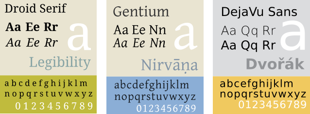
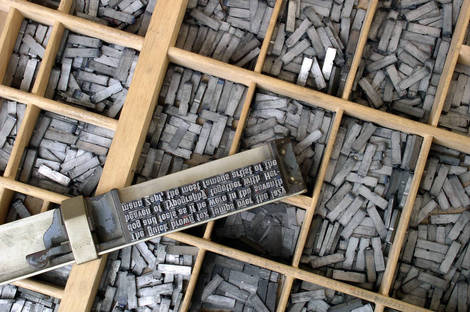

Scegliere i caratteri tipografici
=================================

 In tipografia, i caratteri tipografici si riferiscono a degli insiemi
di glifi o simboli disegnati per funzionare insieme. Degli esempi sono:
Times, Garamond, Helvetica, Futura, DejaVu, Droid, ...  Vengno anche
chiamati in famiglie di caratteri. Questa rappresentazione visiva
raggruppa tutti i corpi e i pesi d'una stessa famiglia, il cui stile è
coordinato e forma un alfabeto.

*Estratti dei font Police Droid, Gentium e Dejà Vu. Fonte delles immagini: QBK, un Wikimedia common, cc-by-sa,[http://commons.wikimedia.org/wiki/File:DroidSerifSpecimen.svg](http://en.wikipedia.org/wiki/File:GentiumBlue.svg);  Tengu800, su Wikipedia, cc-by-sa, [http://en.wikipedia.org/wiki/File:GentiumBlue.svg,](http://en.wikipedia.org/wiki/File:GentiumBlue.svg%20);  Moyogo, su Wikimedia comon, pubblico dominio [http://commons.wikimedia.org/wiki/File:DejaVuSans.svg](http://commons.wikimedia.org/wiki/File:DejaVuSans.svg)*

Puntualizzazioni
----------------

Un font ha un solo peso (per esempio il grassetto) e un solo stile (per
esempio Roman o Corsivo), altrimenti si parla di famiglia di font (per
esempio tutte le Helvetica).

Esempio:

-   Gentium è un font
-   Gentium, corpo 12, grassetto è un carattere, dunque una forma del font.

Il termine font ci viene -- attraverso l'inglese -- dal francese "fonte", ed è legato all'epoca in cui i caratteri venivano creati fondendo il piombo.

 

*Le "Casse" tipografiche (cassetti) et le righe che servivano a piazzare i caratteri. Fonte dell'imagine: Wikimédia Common, par Willi Heidelbach, Creative common by-sa : [http://commons.wikimedia.org/wiki/File:Metal\_movable\_type.jpg](http://commons.wikimedia.org/wiki/File:Metal_movable_type.jpg)*
