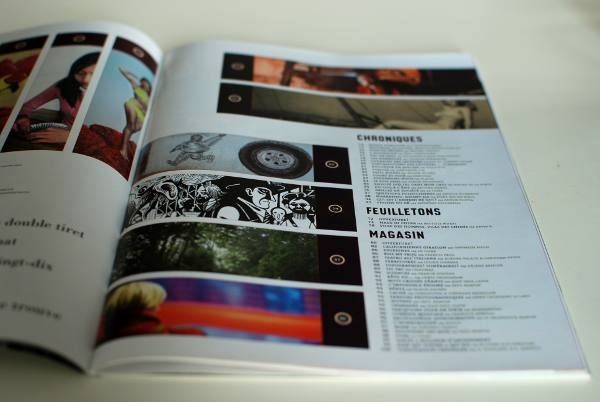
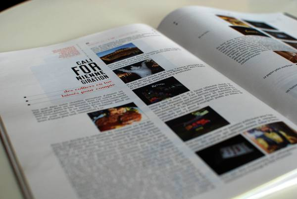
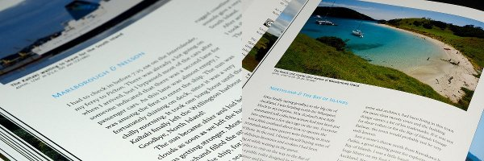

# Esempi di utilizzo

Questo capitolo vi presenterà qualche esempio di lavoro realizzato con l'aiuto di Scribus in differenti contesti artistici e professionali.

&nbsp;

## Un magazine generalista indipendente: Le tigre

&nbsp;

_Le Tigre_ è un magazine generalista indipendente e senza pubblicità fondato nel 2006, distribuita nei chioschi e nelle librerie. Vi collaborano giornalisti, fotografi, disegnatori, scrittori e universitari.

&nbsp;

_Le Tigre_ si distingue per la sua eterogeneità: si possono leggere lunghi reportage di scrittori, articoli geopolitici, opuscoli, strisce a fumetti, foto e critiche della società consumistica...

_Le Tigre_ è il primo giornale in Francia ad essere progettato unicamente con programmi liberi.

&nbsp;

&nbsp;

## Un libro di viaggi sulla Nuova Zelanda

Marcus Holland-Moritz ha viaggiato due mesi in Nuova Zelanda nel 2009. Dalle numerose foto e dagli aneddoti sono state riportate in questo libro. In questa magnifica opera parla del suo viaggio.

Questo libro è stato pubblicato sotto licenza Creative Common BY-SA-ND. Per saperne di più, consultate il suo sito [http://zrox.org/nzbook/](http://zrox.org/nzbook/).

## Una brochure per Wikipedia Bookshelf

Il progetto "Wikipedia Bookshelf" raccolto e creato da materiale informatico su Wikipedia, questo progetto serve a presentare Wikipedia ai nuovi collaboratori e ad altri no-wikipediani.

Wikimedia incoraggia l'utilizzo di Scribus per la creazione di questo materiale, difatti i documenti più recenti sono stati creati con Scribus.

\
