# Packen wir es an!

Hier werden wir Scribus in sieben Schritten vorstellen. Wir zeigen, wie man einen Flyer (Faltprospekt) erstellen kann.

## Eine Handskizze des Dokumentes

Wir beginnen nicht gleich am Computer, sondern machen zuerst eine Skizze auf Papier. Das meiste, das wir mit Scribus erstellen, wird anschließend ja auf Papier ausgedruckt.

Wir verwenden ein A4-Blatt und falzen es zweimal, so dass wir auf jeder Seite drei Flächen haben. Hier ist es wichtig zu wissen, dass die Seite, die dann nach innen gefalzt wird, etwas schmaler sein soll, damit sie sich gut einpasst. (Wir berücksichtigen das allerdings in dieser Einführung nicht.)

Nun skizzieren wir einige grafische Elemente auf diese Titelseite: Ein Bild, ein Logo, einen Titel, so dass der Leser sofort weiß, worum es geht.

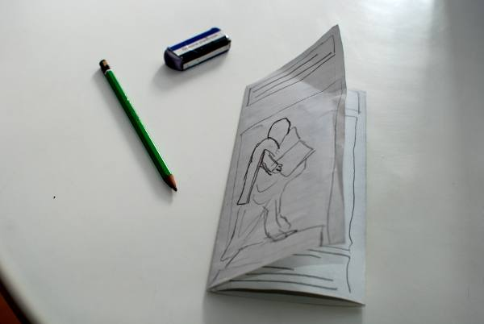

Einige Kommentare:

- Bis der Entwurf so aussieht wie man sich das vorstellt, lohnt es sich in dieser frühen Phase, mehrere Skizzen anzufertigen.
- Man arbeitet mit Papier, Bleistift und Radiergummi - das ist ein Entwurf und kein Kunstwerk. Das Ziel ist, so schnell wie möglich eine Skizze zu erstellen.
- Entwürfe die nicht passen, soll man ruhig im Papierkorb entsorgen.

Sobald klar ist, wie die Leserichtung läuft, soll der Inhalt - Text und Bild - auf die Seiten verteilt werden.

Bei der Leserichtung sind die Falze zu berücksichtigen: Üblicherweise werden die drei Innenseiten für die Hauptaussagen verwendet, so dass drei Spalten entstehen, die man einheitlich ansehen kann. Die drei anderen Seiten (die Außenseiten) haben in der Regel spezifische Aufgaben:

Die drei anderen Seiten (die Außenseiten) haben in der Regel spezifische Aufgaben:

- Die rechte Spalte ist die Titelseite, sie entspricht in etwa der Skizze mit der wir angefangen haben. Das ist auch die wichtigste Seite, um die Aufmerksamkeit auf den Prospekt zu fokussieren.
- Die mittlere Spalte ist die Rückseite des Prospektes. Hier stehen normalerweise die Kontaktangaben.
- Die linke Spalte ist die erste Seite, wenn der Prospekt geöffnet wird. Die kann man gut für Highlights verwenden.

In den unten abgebildeten Bildern kann man sehen, wie solche Seiten skizziert werden:

- Text wird mit Linien in Kästchen markiert. Zur Verdeutlichung können eventuell Erläuterungen hinein geschrieben werden.
- Bildfenster werden mit gekreuzten Kästchen markiert oder mit einer Skizze des Bildes.

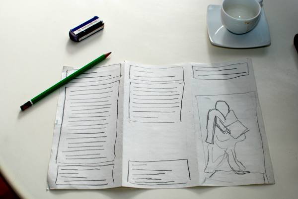

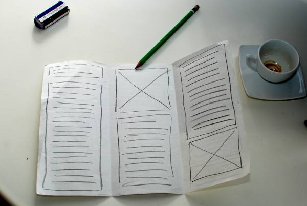

In dieser Einführung stellen wir eine Broschüre über Johannes Gutenberg her. Immerhin hat er in Europa ja die Buchdruckerkunst erfunden. Dazu werden wir Texte und Bilder von Wikipedia benutzen, die einer Creative Commons Lizenz unterstehen.

## Ein neues Dokument erstellen

Beim Scribus-Start wird ein Dialog gezeigt, womit ein neues Dokument erstellt werden kann. Falls dieser schon geschlossen wurde, kann er durch das Menü _Datei > Neues Dokument_ wieder angezeigt werden.

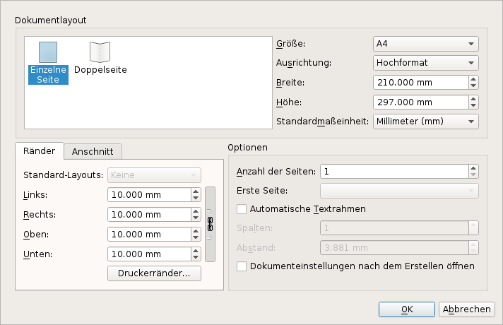

Unser heutiges Dokument hat folgende Charakteristiken:

- Layout: _Einzelne Seite_
- Größe: _A4_
- Ausrichtung: _Querformat_
- Zwei Seiten, eine für jede Seite des Blattes
- Die Standardmaßeinheit soll _Millimeter_ sein, denn oft steht beim erstmaligen Gebrauch "Punkte".
- Ränder: Kette schließen und  _1 cm_ eintippen (wird dann als 10 mm angezeigt). Das ist ein großzügiger Rand, der mit allen Druckern kompatibel ist.

Alle anderen Einstellungen so belassen wie sie sind.

Nun auf OK klicken und das Dokument wird erstellt.

Hier sieht man den Aufbau der Scribus-Arbeitsfläche:

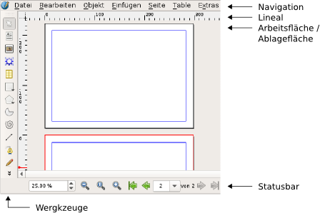

Jetzt ist die Zeit, das Dokument abzuspeichern. Daher wird im Verzeichnis _Meine Dokumente_ ein Ordner _Scribus Gutenberg_ erstellt. Das Dokument wird dann mit einem aussagekräftigen Namen gespeichert.

## Hilfslinien erstellen

Um ein genaues Arbeiten zu erleichtern, werden wir zuerst Hilfslinien erstellen, damit das Dokument die Falz-Struktur bekommt. Dazu wird das Menü _Seite > Hilfslinien bearbeiten_ angeklickt.

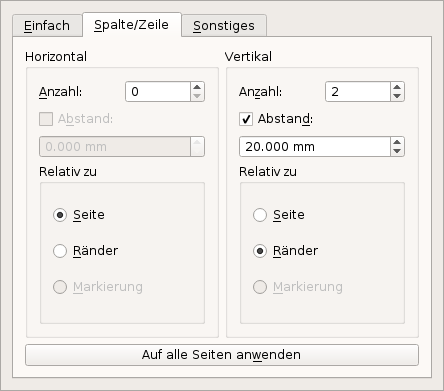

Im mittleren Reiter _Spalte / Zeile_ werden nun zwei vertikale Hilfslinien erstellt, mit einem Abstand von 2 cm. Der Abstand ist das Doppelte der Seitenränder. Um einheitlich breite Spalten zu bekommen, soll die Option _relativ zu den Rändern_ gesetzt werden.

_Auf alle Seiten anwenden_ anklicken und den Hilfslinien-Manager schließen. Auf der Arbeitsfläche werden diese vier Linien rot angezeigt.

Die Datei wieder mit _ctrl+s_ speichern.

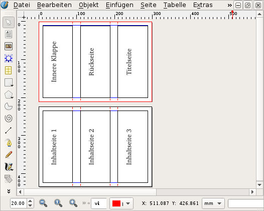

Nun stellt man sicher, dass die Option _An Hilfslinien Ausrichten_ im _Seite_-Menü aktiv ist.  
Die Sichtbarkeit der Hilfslinien kann über das Menü _Ansicht > Hilfslinien anzeigen_ gesteuert werden.

## Text schreiben

In Scribus wird der Text nicht direkt in die Seite eingegeben: zuerst werden Textrahmen eingefügt, in die der Text geschrieben oder geladen wird. Grafische Elemente werden meistens ebenfalls in Rahmen eingegeben. Damit können Elemente nach Belieben auf den Seitenflächen verschoben werden.

Nun gehen wir zur ersten Seite des Dokumentes zur rechte Klappe. Wenn nötig muss man mit dem Scrollbalken die Arbeitsfläche etwas verschieben und mit der Lupe in der Statusleiste die Vergrößerungstufe an der Fenstergröße anpassen.  
Zwei Tipps: die Vergrößerung kann auch durch das gleichzeitige Drücken der Ctrl-Taste und drehen des Mausrades angepasst werden, mit dem Drücken des Mausrads kann das Dokument in alle vier Richtungen verschoben werden.

Das Textrahmen-Werkzeug über das Menü _Einfügen > Textrahmen einfügen_ oder den  Knopf in der Werkzeugleiste aktivieren und mit der Maus durch Klicken und Ziehen einen neuen Rahmen zeichnen.

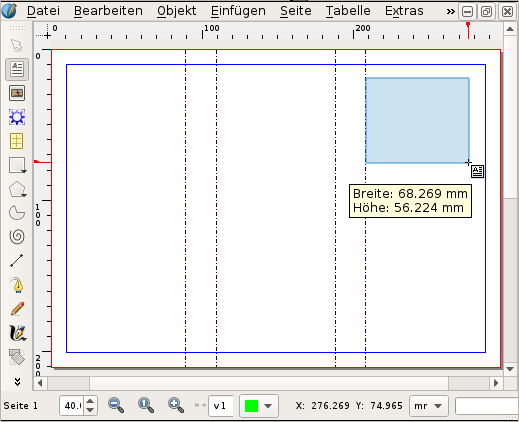

Mittels Klicken und Ziehen des roten Vierecks in der unteren Ecke des Rahmens verändern wir die Rahmengröße, bis der Titel _Johannes Gutenberg_ auf zwei Zeilen darin passt.

Sobald der Rahmen gezeichnet ist, wechselt Scribus automatisch in den _Objekt auswählen_-Modus (das weiße Pfeil-Icon in der Werkzeugleiste), damit Objekte ausgewählt oder verschoben werden können.

Durch einen Doppelklick in den Textrahmen kann man Text eingeben. Sobald wir uns im Texteingabe-Modus befinden, können wir Gutenbergs Name eingeben.

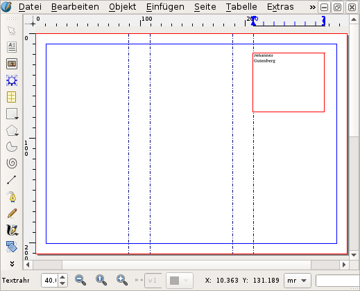

Nun, man sieht, der Text ist ziemlich klein. Um die Schriftgröße zu erhöhen, markiert man den ganzen Text (Tipp: im Texteingabe-Modus durch das Menü _Bearbeiten > Alles auswählen_), dann die Eigenschaftspalette anzeigen (Menü _Fenster > Eigenschaften_) und den Reiter _Text_ aktivieren. Hier kann man nun unterschiedliche Schriften, Schriftfarbe und Größe ausprobieren.

Wenn durch die Größenveränderung die Zeilen zu eng aneinander kleben, soll der _Feste Zeilenabstand_ ebenfalls vergrößert werden. Für den eigentlichen Inhaltstext ist ein Zeilenabstand von 120% der Schriftgröße empfehlenswert.

Die Eigenschaftspalette ist die Schaltzentrale und kann mit der Funktionstaste F2 angezeigt und versteckt werden.

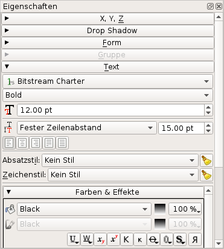

Den Editiermodus verlässt man durch Klicken außerhalb des Rahmens oder durch Drücken der _Esc_-Taste. Ein Doppelklick auf den Textrahmen führt uns zum Texteingabe-Modus zurück.

## Bild einfügen

Zunächst werden wir ein Bild einer Gutenberg-Statue auf der Titelseite einfügen. Das Bild kann von Wikimedia Commons heruntergeladen werden:

<http://commons.wikimedia.org/wiki/File:Statue_de_Gutenberg_à_Strasbourg.jpg>

Erstelle ein Unterverzeichnis _Bilder_ und lade die größte Datei ("full resolution") hinein.

Das Bild-Werkzeug durch das Menü _Einfügen > Bildrahmen einfügen_ oder über das Bild-Icon in der Werkzeugleiste aktivieren. Anschließend mit der Maus einen Rahmen auf der Seite aufziehen.

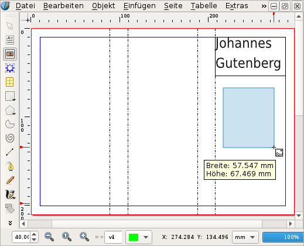

Stelle sicher, dass der Bildrahmen aktiviert ist, dann das heruntergeladenen Bild duch das Menü _Datei > Importieren > Bild laden_ importieren.

Vermutlich sieht man nun lediglich eine weiße Fläche – nur keine Panik. Das ist der Himmel in der linken oberen Ecke! Um mehr als diesen kleinen Teil des Bildes zu sehen, das Eigenschaften-Fenster aufrufen (_F2_), die Gruppe _Bild_ öffnen und _An Rahmen anpassen_ sowie _Proportional_ wählen.

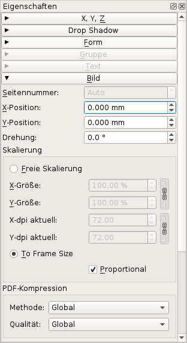

Scribus lädt Bilder immer mit der Bildauflösung, die in der Bilddatei vorgegeben ist. Falls keine definiert ist, benutzt Scribus als Default 72 dpi, was in unseren Fall zu einem übergroßen Bild führt. {wie können wir hier kurz und bündig erklären, dass es um einen import problem geht, aber das bild schon in die richtige grösse vorliegt?}

Eine Alternative ist, mittels Rechtsklick im Bildrahmen das Kontextmenü _Bild an Rahmen anpassen_ zu wählen.

Anschliessend passt man noch den Rahmen am Bild an: in das _Objekt_ Menü oder im Kontextmenü die entsprechende Aktion wählen. Zum Schluss wird das Bild an die linke Hilfslinie geschoben.

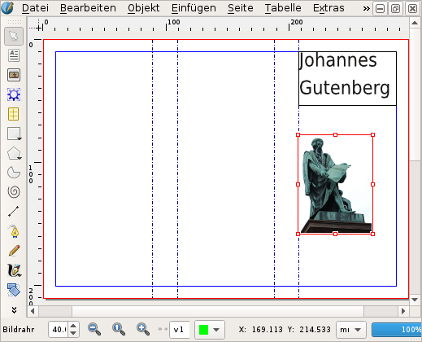

Wenn man nun die kleinen roten Eckpunkte auf der rechten Seite mit der Maus anwählt, kann man den Rahmen auf die Spaltenbreite vergrößern.

## Text einfügen

Es ist in der Regel besser, Text außerhalb von Scribus zu erfassen. Meistens wird der Text von verschiedenen Autoren auf unterschiedlichen Computern verfasst.

Um das zu simulieren, verwenden wir einen Text über Gutenberg aus Wikipedia:

<https://de.wikipedia.org/wiki/Johannes_Gutenberg>

Wir kopieren den Teil "Herkunft und Jugend", dann öffnen wir einen Texteditor und erstellen eine neue Datei, wo wir den Text einfügen. Die Datei wird in einem neuen Unterordner namens _Text_ als _Junge-Jahre.txt_ abgespeichert.

Nun erstellen wir einen Textrahmen in der linken Spalte der _inneren Klappe_, der genau zwischen die Hilfslinien passt. Anschliessend importieren wir den gerade gespeicherten Text über das Menü _Datei > Importieren > Text laden_.

Mit den gleichen Schritten wie im Abschnitt "Text schreiben" kann die Schriftgröße vom Titel angepasst werden.

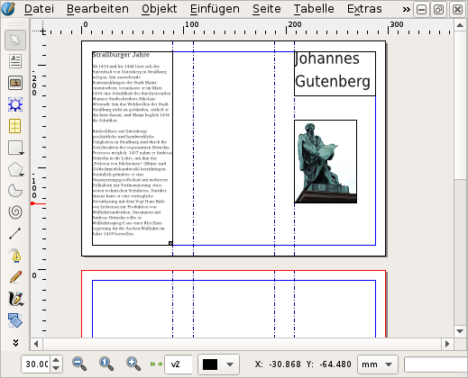

## Textrahmen miteinander verknüpfen

Auf der zweiten Seite des Dokuments werden wir nun Text einfügen, der über alle drei Seiten läuft.

Ein kleiner Trick: nach Aktivierung des Text-Werkzeuges (_Einfügen > Text einfügen_), die Umschalt-Taste gedrückt halten und gleichzeitig mit der Maus in die Arbeitsfläche klicken. Der erzeugte Rahmen füllt die umliegenden Hilfslinien. Das wird dann in den beiden anderen Spalten wiederholt. Oder man zieht selber in jeder Spalte einen Textrahmen auf: dafür ist _Seite > An Hilfslinien ausrichten_ eine wertvolle Hilfe.

Nun ist das Layout erstellt – noch fehlt der Text. Wir wollen hier einen Mustertext anwenden. Den ersten Rahmen anklicken und durch das Menü _Einfügen > Beispieltext_ den "Standard Lorem Ipsum" wählen.

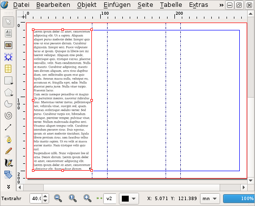

Ganz unten rechts sieht man ein kleines rotes Quadrat mit einem X drin. Das zeigt an, dass nicht der ganze Text im Rahmen Platz hat. Zuerst stellt man sicher, dass der erste Rahmen aktiv ist, dann das Werkzeug _Textrahmen verketten_  aktivieren und mit der Maus in den Rahmen in der zweite Spalte klicken. Das dann für die dritte Spalte wiederholen: spalte zwei auswählen, _Textrahmen verketten_ aktivieren und in der dritte Spalte klicken.

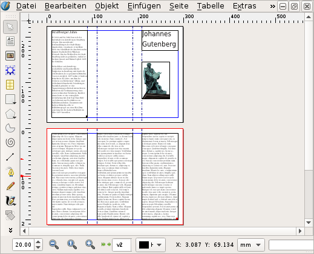

Und wieder nicht vergessen: regelmäßig speichern!

## Gratuliere!

Das erste Layout ist geschafft. Sicher noch nicht perfekt, jedoch ein sehr guter Start mit Scribus.

Im realen Leben würde dieses Dokument nun als PDF exportiert. Das würde heute jedoch zu weit führen, dafür gibt es Tutorials, Foren, Facebook-Gruppen und auch – nicht zuletzt – einige sehr gute Anleitungsbücher.

## Wichtige Elemente der Werkzeugleiste

-  Objekt auswählen
-  Textrahmen einfügen
-  Bildrahmen einfügen
-  Render-Rahmen einfügen
-  Tabelle einfügen
-  Form einfügen
-  Polygon einfügen
-  Line einfügen
-  Bézierkurve einfügen
-  Freihandlinie einfügen
-  Objekt drehen
-  Vergrößern oder verkleinern
-  Rahmeninhalt bearbeiten
-  Text bearbeiten
-  Textrahmen verketten
- Verkettete Textrahmen trennen
-  Abstandsmesser
-  Eigenschafen übertragen
-  Farbwähler

## Weitere Themen

## farben

- Eigenschaftspalette Wenig farben
- Fast zu viele farben
  - In ein Dokument, so wenige Farbe wie möglich gebrauchen
  - Oft durch "Corporate Identity" bestimmt
- Pipette vom Bild zum Titel
- Farben in der Eigenschaftspalette: Rahmen, Hintegrund, Text
- `Bearbeiten > Farben`
  - Neu
  - Importieren
- RGB und CMYK: Generell, RGB gebrauchen
  - Laser-/Tintenstrahldrucker erwarten RGB
  - Fotos sind RGB
  - Bildschirm ist nicht kalibriert und RGB
  - So spät wie möglich in CMYK umwandeln (ausser du weisst was du machst!)
  - Falls die Druckerei CMYK verlangt, ICC Farbprofile gebrauchen.

## produce a pdf and print it

make sure that there is no scaling
- preflight verifier
- screen / web
- fonts include
- pdf version (den drucker fragen sonst 1.4)

# verweisen auf...

- flossmanual auf englisch
- F1 hilfe

# todo

- in the picture set "innere Klappe" instead of "inner flap"
