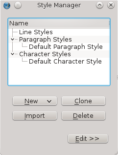
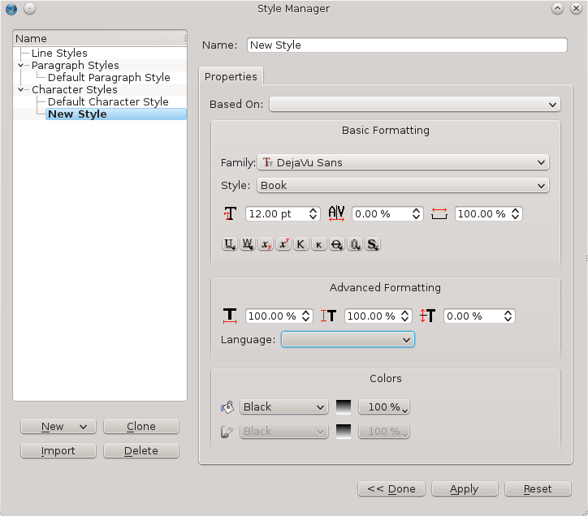

Gli stili
===========

Secondo i documenti da elaborare, il metodo di produzione può essere
ottimizzato in modo da facilitare i compiti ricorrenti. Quando il testo
è ingombrante e strutturato in maniera regolare e costante (titolo,
sottotitolo, didascalie, blocco di citazione, note, leggende, ecc.), i
fogli di stile sono certamente il migliore mezzo per garantire una
permanenza nel lavoro. I fogli di stile permetteranno di memorizzare un
certo numero di parametri da applicare a testo o quadri ed all'insieme
delle loro proprietà di un semplice clic.

I vantaggi di strati di stili sono numerosi:

-   aumentano la **produttività**;

-   permettono **di semplificare i cambiamenti** grafici decisi
    all'ultimo minuto;

-   permettono di garantire una migliore **permanenza nelle** messe in
    forma **evitando gli errori**;

-   permettono di conformarsi più facilmente ad una **carta grafica** al
    quale il documento può riferirsi;

-   ne facilita la fruizione per il lettore;

-   facilitano il lavoro da parte di molte persone sul documento…

Gli inconvenienti sono più rari:

-   occorre prédéfinir prima di applicare ed accettare di passare alcuni
    secondi:)

Create stili
------------

Infatti, creare stili non prende più di alcuni secondi. In realtà,
anziché definire l'aspetto per mezzo della finestra (proprietà), basterà
definire le stesse proprietà nella finestra (editore di stili),
accessibile a partire dal menu (*modifica \> stili*).

 

**Consiglio:** iniziate/ create i vostri stili all'inizio del vostro
lavoro d'impaginazione. Se non sapete esattamente quale sarà l'aspetto
dei vostri testi, potrete modificarli successivamente. Cominciate col
mettere proprietà ovvie in modo visivo bene per mettere in valore la
struttura del documento, il completamento dell'aspetto potrà anche
derivare di là osservando in un colpo solo le pagine costruirsi
secondo i cambiamenti operati negli stili definiti.

 

La finestra (editore di stili) è composta da due parti principali:

-   a sinistra, l'amministratore e la lista degli stili categorizzati
    d'applicazione: stili di paragrafo, stili di caratteri e stili di
    linea;

-   a destra, la lista delle proprietà applicabili allo stile scelto
    secondo la sua categoria.

Per creare uno stile, qualunque in sia la categoria, basta passare per
alcune tappe semplici:

1.  Pubblicate (editore di stili) con il menu (*modifica \> stili*);

2.  Premete sul bottone nuovo in fondo della finestra e scegliete la
    categoria che li interessa O preme con il bottone diritto sul titolo
    di una categoria nella lista e sceglie l'entrata di menu (nuovo) che
    corrisponde a questa categoria;

3.  La finestra si aumenta allora sulla destra per pubblicare le
    proprietà grafiche proprie di questa categoria e che possono essere
    utilizzate per definire l'aspetto degli elementi;

4.  La prima cosa da modificare è (nome) dello stile che deve essere
    unico nel documento. Se il nome scritto è già utilizzato, Scribus vi
    chiede di volere scegliere un nuovo. Vi consigliamo di scegliere
    titoli che fanno riferimento alla struttura semantica del testo:
    Titolo piuttosto che Grassetto, o citazione piuttosto che in corsivo
    ad esempio. Ciò permette di evitare confusioni se l'aspetto deve
    essere cambiato.

### Stili di caratteri

Gli stili di caratteri e di paragrafi si applicano tutti e due al testo.
Si differenziano con la dimensione alla quale li applicherete e con le
proprietà che considerano.

Gli stili di caratteri permetteranno di cambiare una **parte di testo
scelta all'interno di una frase** o di un paragrafo. E soltanto se si
tratta di una parte di quest'insieme. Se tutto il paragrafo deve avere
lo stesso aspetto, pensa alla possibilità di utilizzare uno stile di
paragrafo.

Ad esempio, avete un testo che contiene numerose cifre (dati statistici
ad esempio) ed auspicate che tutte queste cifre appaiano in un colore
identico ed eventualmente con un carattere diverso o grasso una per
metterli un po'in evidenza. Potreste scegliere le cifre ad una ed andare
nella finestra (proprietà) per cambiare il colore e la larghezza del
carattere (testo). Occorrerebbe ripetere l'applicazione di queste
proprietà per ogni cifra. Con gli stili, tutti i cambiamenti da
effettuare saranno memorizzati:

1.  Aprite l'editore di stili con il menu (*modifica**\> stili*);

2.  Premete sul bottone (nuovo) in fondo dell'editore di stili e
    scegliete (stili di carattere);

3.  Nella finestra che appare, definite un nome come CifreStatistiche;

4.  Scegliete un nuovo font e più sotto nella finestra, scegliete il
    colore. Solo i colori definiti nella tabella del documento sono
    disponibili. Per cambiare questa lista rinviate al capitolo scelta
    dei colori;

5.  Cambiate tutte le proprietà che desiderate e quando avete finito,
    premete su (applicare) per memorizzare i cambiamenti operati.

Le proprietà definibili negli stili di caratteri corrispondono ai
parametri di base, della rubrica (colori ed effetti), ed alcuni
parametri avanzati (*Advanced settings*) dell'unghia (testo) della
finestra (proprietà). Si tratta soltanto di parametri per cambiare
l'aspetto delle lettere e soltanto questi. Per avere più proprietà,
rinviate agli stili di paragrafo.

Stili di paragrafi

Come il loro nome lo indica, gli stili di paragrafi permetteranno di
modificare di un solo clic tutti i parametri di un paragrafo. Per
visualizzare la dimensione di un paragrafo e non confonderlo con un
ritorno alla linea semplice, utilizzate il menu (*visualizzazione \>
pubblicare i caratteri invisibili*).

Gli stili di paragrafi permetteranno di definire allo stesso
tempo l'aspetto dei caratteri del paragrafo, facendo riferimento ad uno
stile di carattere o non, e parametrizzare i flussi di testo in
quest'ultimo: allineamento, iniziali, tabulazioni, spazio di e dopo,
margini sono parametri tipici che si trovano negli stili di paragrafo
soltanto, e per alcuni soltanto qui poiché non hanno la possibilità di
essere applicata dalla finestra (proprietà), ad esempio iniziali, spazi
e margini.

1.  Pubblicate l'editore di stili con il menu (*modifica \> stili*);

2.  Premete sul bottone (nuovo) in fondo dell'editore di stili e
    scegliete (stili di paragrafo);

3.  Nella parte diritta che appare, definite un nome come titolo;

4.  Nella scheda (proprietà) di questa finestra, modificare i parametri
    che vi sembrano utili. In generale, i titoli sono preceduti di uno
    spazio di e dopo, e possono eventualmente essere centrati.

5.  Nella scheda(stile di carattere), sarà possibile definire l'aspetto
    delle lettere dello stile. Le proprietà presenti sono identiche a
    quelle disponibili per gli stili di carattere. La lista superiore
    (basato su) permette di fare esplicitamente riferimento ad uno stile
    di carattere già creato che sarà così utilizzato come base per
    questo paragrafo.

### Stile linea

Gli stili di linea sono un caso speciale, meno utilizzati e meno
conosciuti. Permettono di creare linea che saranno utilizzate
successivamente come bordo di quadro o per gli attrezzi linee e Bézier.
L'utilizzo di stili permette così di garantire una permanenza
nell'aspetto dei bordi, ma la finestra offre la possibilità di creare
tipi di linea non disponibili per difetto in Scribus, come linea doppie.

1.  Pubblicate l'editore di stili con il menu (*modifica \> stili*);

2.  Premete sul bottone (nuovo) in fondo dell'editore di stili e
    scegliete (stili di linea);

3.  Nella parte diritta che appare, definite un nome come
    EncadreCitation;

4.  La parte inferiore contiene a sinistra la lista delle linee che
    definiscono la rete (per difetto, c'è soltanto una rete fine), ed a
    destra la lista delle proprietà per la linea scelta. La rete è tutte
    queste linee definite.

5.  Premendo su (+) sopra la lista, è possibile aggiungere linea che si
    combineranno al finale.

6.  Le proprietà di ogni rete possono essere modificate nella parte
    diritta. Ad esempio, per la rete superiore, cambiate lo spessore ad
    1 e cambiate il colore a blu. Premete sulla linea inferiore e
    scegliete un linea punteggiato nella lista quindi una conclusione
    arrotondata con uno spessore di 5pt.

7.  La descrizione della rete completa è pubblicata sotto le proprietà.

Notate che la rete più la fine è sempre automaticamente messa sopra, e
che le linea sono centrate gli uni sugli altri senza che sia possibile
personalizzare questi comportamenti.

Applicare gli stili
-------------------

Una volta gli stili definiti, appariranno a diversi posti
dell'interfaccia di Scribus in modo da potere applicarli sugli elementi
testuali o i quadri.

La finestra (proprietà) resta la posizione centrale della quale avrete
accesso agli stili definiti.

### Stili di paragrafi e caratteri

Per quanto riguarda gli stili di testo, saranno elencati nella scheda
(*testo \>**impostazione**di stili*). Qui ci sono due scelte: una per
gli stili di paragrafo, l'altro per gli stili di carattere. Lo stile
applicato e quello che è visibile. Gli altri stili creati sono
semplicemente applicabili svolgendo la lista.

Per applicare lo stile di paragrafo, basta semplicemente piazzare il
cursore, è inutile scegliere del testo. In compenso, nel caso dello
stile di carattere, sarà applicato soltanto alla parte scelta. Notate
che se il quadro solo è scelto, lo stile è applicato all'insieme.

Il metodo globale che consigliamo è il seguente:

1.  Applicate gli stili di paragrafi;

2.  Applicate gli stili di caratteri;

3.  Soltanto in seguito, giocate con le diverse altre proprietà
    tipografiche della finestra (proprietà).

Scribus segue quest'ordine logico per pubblicare il testo. Così, una
proprietà, ad esempio una sottolineatura o un colore, applicato
direttamente da partire da un'opzione della finestra (proprietà)
resteranno presente, anche se lo stile applicato prima di tutto è
modificato, o se un nuovo stile è applicato. Queste formattazioni
manuali possono essere chiamate “sostituzione„ o “sovraccarico„.
Considerate le opzioni tipografiche delle proprietà come un attrezzo di
completamento di evitare i problemi di sovraccarico tipografico. Se
desiderate annullare un **sovraccarico su una** parte di testo,
scegliete semplicemente questa parte e premete sul bottone sotto forma
di spazzola (elimina la **formattazione manuale del** paragrafo) messa a
destra delle liste di stili. Il vostro testo troverà così l'aspetto così
come è definito nello stile solo.

### Stile linea

Gli stili di linea sono pubblicati nella zona messa sotto le proprietà
Nella scheda *linea**d**ella* finestra (proprietà). Questa lista,
pubblica anche la descrizione degli stili per facilitare la scelta. Per
applicare uno stile di linea, scegliete semplicemente il quadro e
premete sullo stile adeguato.

Modificate uno stile
--------------------

Gli stili che sono stati creati ad un momento dell'impaginazione sono
modificabili in qualunque momento.

1.  Tornate nell'editore di stili (*modifica**\> stili*);
2.  Scegliete lo stile da cambiare nella lista;
3.  Effettuate i cambiamenti necessari nelle proprietà dello stile;
4.  Premete sul bottone (applica). I cambiamenti sono visibili immediatamente nell'impaginazione.

In occasione della modifica di uno stile, tutti gli elementi ai quali lo
stile era applicato sono automaticamente aggiornati. Ciò include:

-   I testi e le linee secondo, prendendo conservano al fatto che i
    sovraccarichi sono conservati;

-   Gli altri stili che fanno riferimento a questo stile per mezzo della
    proprietà (basato su) ma non coloro che sarebbero stati creati a
    partire da una copia di uno stile esistente con il bottone
    (clonare);

La modifica degli stili è un complemento essenziale alla loro creazione
e si presenta come la possibilità fondamentale che rende gli stili
realmente produttivi ed utili. Se siete nuovi nell'utilizzo degli stili,
avete in testa che vi spetta decidere quando creare uno stile:
tipicamente quando lo stesso aspetto si riproduce più volte. Esiste
alcuno caso dove stili sono generati automaticamente: in occasione
dell'import di archivi **ODT** o di archivi **HTML**. In questi casi, è
spesso necessario modificare all'aspetto stili importati, o pulire la
lista eliminandone alcuni.

Eliminate stili
---------------

La soppressione di uno stile è una tappa delicata che può modificare
profondamente l'impaginazione poiché l'aspetto di tutti i testi ai quali
lo stile eliminato è applicato sarà modificato. Prima di eliminare uno
stile, garantitevi che quest'azione non genererà problemi fondamentali
nella vostra impaginazione. In tutti i casi, Scribus vi chiederà di fare
una sostituzione.

1.  Nella finestra editore di stile (modifica*\> stili*), scegliete lo
    stile da eliminare;
2.  Premete sul bottone (eliminare) in fondo della lista degli stili o
    premete con il tasto destro sullo stile e scegliete (eliminare) nel
    menu contestuale.
3.  Scribus pubblica una finestra che offre la possibilità di sostituire
    lo stile eliminato da un altro stile esistente che verrà a prendere
    il suo posto sui testi influiti.

Per eliminare molti stili di colpo (spesso utile dopo l'importazione di
archivi ODT), si scelgono tutti e si preme sul bottone (elimina). In
questo caso specifico, solo questo metodo permette di agire
sull'insieme. Scribus elencherà tutti gli stili da eliminare nella
finestra di sostituzione.

Riutilizzate stili già creati
-----------------------------

Altro vantaggio degli stili, e non dei inferiori, gli stili creati in un
documento possono essere riutilizzati in altri documenti. Ciò permette
di guadagnare un tempo considerevole, e garantire una buona consistenza
nella presentazione di documenti che devono avere un'identità ben
visibile sul lungo termine.

Pubblicate l'editore di stili con il menu (*modifica \> stili*);

Premete sul bottone (importare) per pubblicare la finestra
d'importazione;

Nella finestra, scegliete l'archivio che contiene gli stili che
desiderate utilizzare.

Scribus pubblica gli stili per categoria: per difetto, tutti sono scelti
per l'importazione, scoccano quelli che non desiderate importare.

Se il vostro documento in corso contiene già stili, è probabile che
alcuni di loro portano lo stesso nome degli stili che desiderate
importare. Le opzioni (rieleggere gli stili importati) e (sostituire uno
stile esistente) vi saranno molto utili. La prima è attivata da difetto:
è più sicuro, e vi lascia fare prove prima di una soppressione manuale.
