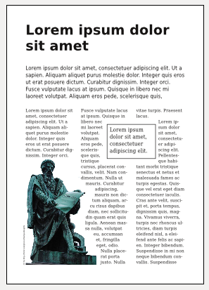

Sagomare il testo
=================

Per impostazione predefinita, le cornici create da Scribus hanno una
forma rettangolare: è quello che si vuole nella maggior parte dei casi e
semplifica la vita quando si vuole vedere una composizione ben
strutturata. Sono programmati per ricevere il testo o immagini
affiancati.

Per aumentare il dinamismo della pagina, specialmente quando si lavora
con delle composizioni con colonne, le cornici possono sovrapporsi:

-   mettete una cornice per dettagliare un punto;
-   evidenziate una parte di testo in una cornice separata;
-   desiderate inserire l'immagine nel flusso del testo...

Il testo viene quindi nascosto dagli elementi che sono stati posti al di
sopra e si desidera vedere il flusso di testo intorno alle immagini,
eventualmente con una forma irregolare.

