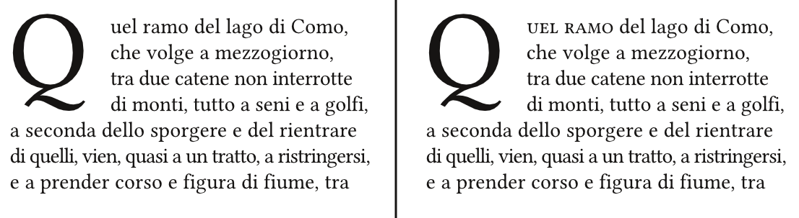

# Le scelte tipografiche

Stiamo entrando nel cuore di Scribus. Abbiamo spiegato come importare il testo in una casella di testo nel precedente capitolo "Importare testo ed immagini". L'obiettivo di questo capitolo è quello di rivedere tutte le funzioni legate alle scelte tipografiche a alla formattazione del testo.

Da subito, si può notare che alcune impostazioni sono accessibili solo nell'_Editor interno_ ma non dalla finestra _Proprietà_. I due menu operano in modo complementare. 

## La gerarchia delle informazioni

Spesso il lavoro del grafico è paragonato a quello del regista: il regista deve disporre gli attori sul luogo scenico in modo da riuscire a raccontare la vicenda voluta, il grafico deve disporre gli elementi nella doppia pagina in modo da trasmettere il messaggio voluto. Al lettore come allo spettatore viene proposto uno spettacolo che alterna i colpi di scena alla narrazione: la gerarchia delle informazioni deve guidarci nella lettura degli elementi più importanti e di quelli secondari.

Per questo motivo spesso il contenuto viene suddiviso in diversi livelli di lettura. Questa gerarchia dovrà stabilire l'ordine di lettura dei vari elementi attraverso degli espedienti tipografici e/o visivi. Il nostro obiettivo non è quello di discutere le scelte tipografiche in questione (quale font è più leggibile, quali colori sono di più forte richiamo visivo), ma di mostrarvi il ventaglio di possibilità che Scribus vi offre per gestire questi elementi.

Segue una lista non esaustiva degli elementi testuali che si possono trovare in una pubblicazione. Ogni specifico progetto presenterà nelle sue doppie pagine alcuni di questi elementi, quelli che saranno utili a comunicare il contenuto in questione. Vi consigliamo di analizzare qualche pubblicazione a voi familiare, prestando attenzione agli espedienti che aiutano a realizzare una gerarchia delle informazioni.

- Testata
- Titolo, sottotitolo, occhiello etc.
- Capilettera
- Corpo del testo
- Leggende di foto o illustrazioni
- Crediti
- Intestazioni
- Estratti
- Epigrafi
- Citazioni
- Note a piè di pagina
- Note a margine
- Ricorrenti (Numero di pagina, Indicatore di capitolo, di sezione etc.)
- Testi rientranti
- Elenchi (numerati, puntati etc.)

Ogni elemento testuale deve corrispondere uno stile tipografico specifici. Il vostro compito è quello di determinare questi stili, le caratteristiche di ognuno di essi, in modo da stabilire il loro ordine di lettura. Per esempio: il titolo deve colpire, deve essere il primo elemento che attira l'attezione, seguito dal sottotitolo. Dovete proporre al lettore una combinazione intelligente di contrasti, giochi di luce, colori e ombre.

Attraverso la gerarchizzazione di questi elementi deve guidare il lettore nella pagina, indicandogli quali elementi leggere prima, quali in seguito e quali sono gli elementi marginali o secondari (es. le note).

## Gli attributi tipografici

Gli elementi che andiamo a descrivere costituiscono la vostra palette tipografica. Il loro utilizzo vi aiuterà nel gerarchizzare il contenuto. Scopriteli, familiarizzate con il loro uso.

### Il capolettera

Uno degli elementi più scenografici per il vostro testo è il _capolettera_: la prima lettera della prima parola della riga di testo viene messa in evidenza. Solitamente ha un corpo maggiore delle altre lettere (una dimensione maggiore in pt), ma può variare anche in peso e in colore, al fine di attirare l'attenzione sul punto di inizio della lettura. Per creare un _capolettera_ con Scribus bisogna creare un nuovo _Stile di paragrafo_ [ Modifica &gt; Stili &gt; Nuovo &gt; Stile paragrafo]. In questa finestra spuntate la voce _Capolettera_: qui potete stabilire la dimensione della prima lettera in righe di testo (se digito due, il mio capolettera sarà occuperà l'altezza della prima e della seconda riga di testo). L'altro parametro definibile è la sua distanza dal testo. Il peso del carattere e il colore si definiscono dal pannello _Proprietà &gt; Testo_, dopo aver evidenziato il capolettera nella casella di testo_. _Se la prima parola è molto corta, o se volete semplicemente ridurre il constrasto tra il capolettera e il testo, si può ricorrere all'utilizzo _maiuscoletto_ per le prime parole (Pannello delle Proprietà &gt; Testo). Prestate attenzione, il _maiuscoletto_ come il _corsivo_ sono due stili legati al carattere tipografico: potremmo usarlo solo se la famiglia di font scelta lo presenta tra le sue variabili (Roman, Italic, Bold etc.), chiamati in inglese _caption_ o _caps o SC_.

### Le legature, le cifre elzeviriane, apici e pendici

Le _legature_ sono dei glifi che vanno a sostituire una coppia di lettere in successione: per esempio la coppia di lettere f+i può apparire legata in un solo segno. Possono essere inserite nel programma che usate per la scrittura o direttamente in Scribus attraverso il menu _Inserire &gt; Legature._

Le _cifre elzeviriane_ o numeri maiuscoletti vengono molto utilizzati per rendere più fluido l'inserimento dei numeri (date, cifre, statistiche etc.) nel testo. Si possono inserire dalla menu _Inserire &gt; Glifi_.

Le cifre e le lettere possono essere poste in _apice o pendice_ dal pannello _Proprietà &gt; Testo_ oppure inserite dal menu _Inserire &gt; Glifi_. Si possono regolare gli spostamenti della linea di base nel pannello di controllo sotto il menu_ Scribu &gt; Preferenze &gt; Tipografico_: si consiglia di controllare ed eventualmente modificare queste distanze a seconda del font utilizzato. Proprio per questo nei _glifi_ di molti caratteri tipografici vengono inseriti numeri più utilizzati in apice, 1, 2, 3.

Bisogna prestare molta attenzione anche al corretto uso di _virgolette ed apostrofi_: ogni lingua presenta le proprie particolarità. La lingua italiana permette l'uso di tre tipi di virgolette:

*   virgolette alte semplici o singoli apici › ‘contenuto’
*   virgolette alte doppie o doppi apici › “contenuto ”)
*   caporali › «contenuto»

Importante è mantenere una certa coerenza nell'uso di un ogni tipo di virgolette per un tipo specifico di contenuto. Apostrofi e lettere accentate vanno controllate con attenzione nell'ultima revisione del documento.
